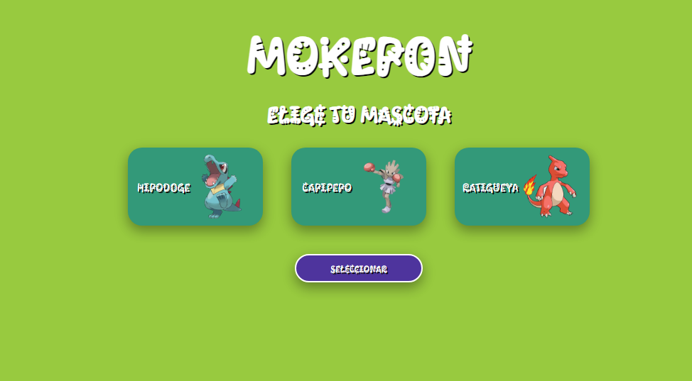

# 🎮 Juego Pokémon

Un juego inspirado en el universo Pokémon desarrollado para navegador web.  
El proyecto fue creado como práctica de programación y desarrollo web interactivo.

## 🚀 Demo del proyecto

Puedes probar el juego aquí:

👉 https://braynel87.github.io/Juego-pokemon.github.io/

## ✨ Características

- Sistema de combate Pokémon
- Interfaz interactiva
- Diseño estilo retro
- Eventos y mecánicas de juego
- Compatible con navegador web

📸 Vista previa



## 🛠️ Tecnologías utilizadas

- HTML5
- CSS3
- JavaScript

## 📦 Instalación

Si quieres ejecutar el proyecto localmente:

```bash
git clone https://github.com/Braynel87/Juego-pokemon.github.io.git
```

Luego abre el archivo `index.html` en tu navegador.

## 🎯 Objetivo del proyecto

Este proyecto fue creado para practicar:

- lógica de programación
- manipulación del DOM
- eventos en JavaScript
- diseño de interfaces web
- desarrollo de videojuegos básicos en navegador

## 📸 Captura del proyecto

Puedes agregar aquí imágenes o screenshots del juego.

## 📁 Estructura del proyecto

```bash
📦 Juego-pokemon.github.io
 ┣ 📜 index.html
 ┣ 📜 style.css
 ┣ 📜 script.js
 ┗ 📂 assets
```

## 👨‍💻 Autor

Desarrollado por Braynel Yecid

GitHub:
👉 https://github.com/Braynel87

## 📄 Licencia

Este proyecto es de uso educativo y personal.